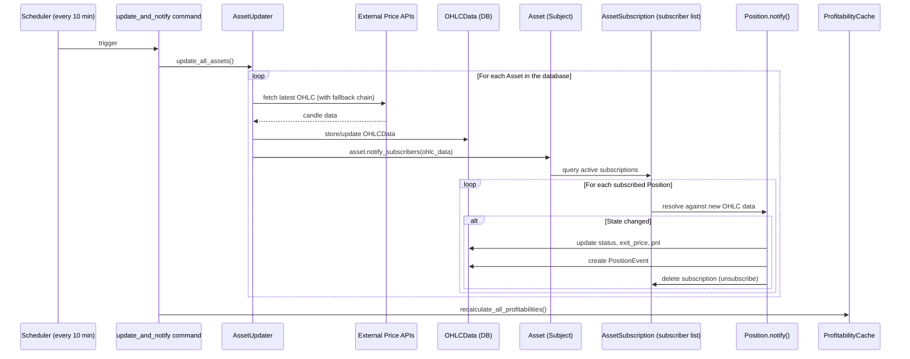
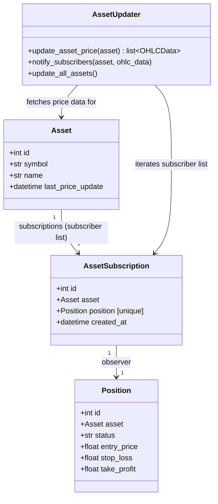

# Observer Design Pattern — Asset → Position Notification

**Date:** 2026-05-14  
**Status:** Draft v4 — revised after feedback  
**Last Updated:** 2026-05-15

---

## 1. Overview

VeriFi uses the **Observer Design Pattern** to keep financial positions in sync with live market data. Assets are the **Subjects (Observables)**, and Positions are the **Observers (Subscribers)**.

A periodic job (every 10 minutes, configurable) fetches updated OHLC price data for **all** assets. When an asset's price data is updated, the asset **notifies** all of its subscribed Positions so they can evaluate whether a state transition has occurred (e.g., entry price hit, stop-loss triggered, take-profit reached).

### Why only Positions, not HardClaims?

HardClaims have a fundamentally different resolution model: they can **only be resolved after their `until` deadline passes**. During a claim's lifetime, incoming price data doesn't trigger any state change — the claim simply waits until its deadline, then the full historical price range is evaluated retroactively. This is a **deadline-triggered check**, not an event-driven reaction, and therefore does not fit the Observer pattern. HardClaims continue to use the existing `resolve_claims` management command.

**Positions**, by contrast, react to price changes **in real-time**: every price update could trigger entry activation, stop-loss, or take-profit. This is the textbook Observer use case — "new data arrives → observer reacts."

---

## 2. Architecture



---

## 3. Observer Design Pattern → VeriFi Mapping

| Pattern Concept | VeriFi Implementation |
|-----------------|----------------------|
| **Subject (Observable)** | `Asset` model |
| **Observer** | `Position` — reacts to price changes by evaluating entry/SL/TP triggers |
| **Subscriber list** | `AssetSubscription` model — explicit table on the Subject side, holding a reference to each subscribed Position |
| **subscribe()** | Creating an `AssetSubscription` row when a Position is created |
| **unsubscribe()** | Deleting the `AssetSubscription` row when the Position reaches a terminal state |
| **notify()** | `Asset` iterates its `subscriptions`, dispatches resolution logic to each active subscriber |
| **update()** | `_resolve_pending()` for PENDING positions; `_resolve_active()` for ACTIVE positions — these are the observer's reaction methods |

---

## 4. Data Model Changes

### 4.1 New Model: `AssetSubscription`

```python
class AssetSubscription(models.Model):
    """
    The subscriber list for the Observer Design Pattern.
    Each row represents one Position subscribing to one Asset.
    """
    asset = models.ForeignKey(
        Asset, on_delete=models.CASCADE, related_name="subscriptions"
    )
    position = models.OneToOneField(
        Position, on_delete=models.CASCADE, related_name="asset_subscription"
    )
    created_at = models.DateTimeField(auto_now_add=True)

    def __str__(self):
        return f"Subscription: Position #{self.position.id} → {self.asset.symbol}"
```

**Key design decisions:**
- `OneToOneField` on `position` — enforces that each Position subscribes to **exactly one** asset.
- `related_name="subscriptions"` on `asset` is the **subscriber list** that the Observable iterates during notification.
- Simple and focused — no polymorphism needed since only Positions observe.

### 4.2 Modify: `Asset` model

Add a `last_price_update` timestamp:

```python
# Add to Asset model
last_price_update = models.DateTimeField(null=True, blank=True)
```

### 4.3 No changes to `OHLCData`

OHLC data remains daily granularity for now.

---

## 5. Implementation Plan

### Phase 1: Models & Subscription Wiring

#### Step 1.1 — Create `AssetSubscription` model
- Add the model to `backend/posts/models.py` (as defined in §4.1)
- Run `makemigrations` + `migrate`

#### Step 1.2 — Add `last_price_update` to `Asset`
- Add the field to `Asset` model
- Run migration

#### Step 1.3 — Auto-subscribe on Position creation
- In `PositionListCreateView.post()` ([views.py:661-706](file:///Users/ardasaygan/Desktop/School_Materials/Signance/Signance/backend/posts/views.py#L661-L706)):
  - After `Position.objects.create(...)`, create an `AssetSubscription`:
    ```python
    AssetSubscription.objects.create(asset=asset, position=position)
    ```

#### Step 1.4 — Backfill existing data
- Create a one-time management command `backfill_subscriptions` that:
  - For every existing `Position` with status in (`PENDING`, `ACTIVE`), creates an `AssetSubscription(asset=pos.asset, position=pos)`
  - Skips if subscription already exists (idempotent)

---

### Phase 2: Asset Updater & Notification Engine

#### Step 2.1 — Create `backend/posts/asset_updater.py`

This is the **Subject's update + notify** logic:

```python
# Pseudocode structure

def update_asset_price(asset: Asset) -> list[OHLCData]:
    """Fetch fresh OHLC from external APIs, save to DB, update timestamp."""
    today = date.today()
    start_date = ...  # earliest relevant date for active positions

    # 1. Fetch directly from external APIs (skip DB cache)
    #    Uses the cascading fallback chain: Binance → Kucoin → Kraken (crypto)
    #    or Yahoo Finance → Twelve Data (traditional)
    raw_rows = fetch_ohlc_for_asset(asset, start_date, today)

    # 2. Persist the fetched data into OHLCData table
    new_ohlc = [
        OHLCData(
            asset=asset, date=row["date"],
            open=row["open"], high=row["high"],
            low=row["low"], close=row["close"],
        )
        for row in raw_rows
    ]
    OHLCData.objects.bulk_create(new_ohlc, ignore_conflicts=True)

    # 3. Update the asset's last_price_update timestamp
    asset.last_price_update = timezone.now()
    asset.save(update_fields=["last_price_update"])

    # 4. Return the saved OHLCData model instances for notification
    return list(
        OHLCData.objects.filter(asset=asset, date__range=(start_date, today)).order_by("date")
    )

def notify_subscribers(asset: Asset, ohlc_data: list[OHLCData]):
    """Iterate the asset's subscriber list and notify each observer."""
    # Explicitly query the AssetSubscription model (the subscriber list)
    subscriptions = AssetSubscription.objects.filter(
        asset=asset
    ).select_related("position")

    for sub in subscriptions:
        _notify_position(sub.position, ohlc_data, sub)

def _notify_position(position: Position, ohlc_data: list[OHLCData], subscription: AssetSubscription):
    """Observer update() — runs resolution logic for a single position."""
    now = timezone.now()

    if position.status == Position.Status.PENDING:
        _resolve_pending(position, now)
    elif position.status == Position.Status.ACTIVE:
        _resolve_active(position, now)

    # Refresh to check if status changed
    position.refresh_from_db()

    # If position reached a terminal state → unsubscribe
    terminal_statuses = {
        Position.Status.MISSED,
        Position.Status.CONFIRMED,
        Position.Status.REJECTED,
        Position.Status.EXPIRED,
        Position.Status.CLOSED_EARLY,
    }
    if position.status in terminal_statuses:
        subscription.delete()  # unsubscribe()

def update_all_assets():
    """Main orchestrator: update every asset, then notify subscribers."""
    for asset in Asset.objects.all():
        try:
            ohlc_data = update_asset_price(asset)
            notify_subscribers(asset, ohlc_data)
        except OHLCFetchError as e:
            # All API providers failed for this asset — log and skip
            logger.error(f"All sources failed for {asset.symbol}: {e}")
            # last_price_update stays unchanged (stale)
            continue
        except Exception as e:
            logger.error(f"Unexpected error for {asset.symbol}: {e}")
            continue
```

#### Step 2.2 — Subscription cleanup on manual close

In `PositionCloseView.post()` ([views.py:708-755](file:///Users/ardasaygan/Desktop/School_Materials/Signance/Signance/backend/posts/views.py#L708-L755)):
- After setting `position.status = CLOSED_EARLY`, also delete the subscription:
  ```python
  AssetSubscription.objects.filter(position=position).delete()
  ```

#### Step 2.3 — Error handling per asset

If all API providers fail for an asset:
- Log the error
- Keep `last_price_update` unchanged (stale)
- Skip notification for that asset (positions remain in their current state)
- Continue to the next asset

---

### Phase 3: Management Command & Scheduler

#### Step 3.1 — New management command: `update_and_notify`

- File: `backend/posts/management/commands/update_and_notify.py`
- This is the **new entry point** that replaces the old `resolve_positions` command for Position resolution
- Flow:
  ```
  1. Call update_all_assets()  →  fetches prices + notifies position subscribers
  2. Call recalculate_all_profitabilities()  →  updates PnL badges
  3. Log summary: X assets updated, Y positions transitioned
  ```

#### Step 3.2 — Deprecate old command

- `resolve_positions.py` — **no longer called** for the Observer flow. Add deprecation notice in the command. The `resolve_claims.py` command remains active for HardClaim resolution (separate concern).

#### Step 3.3 — Scheduler setup

- **Default interval:** 10 minutes (configurable via Django settings)
- Add to `core/settings.py`:
  ```python
  PRICE_UPDATE_INTERVAL_MINUTES = 10
  ```
- **Recommended approach:** Cron job or Render cron:
  ```bash
  */10 * * * * cd /path/to/backend && python manage.py update_and_notify
  ```

#### Step 3.4 — Keep the single-position resolve endpoint

The `PositionResolveView` ([views.py:543-628](file:///Users/ardasaygan/Desktop/School_Materials/Signance/Signance/backend/posts/views.py#L543-L628)) allows a user to manually trigger resolution for their own position on-demand. This remains useful as a **manual bypass** outside the periodic cycle and continues to work independently.

---

### Phase 4: Tests

#### Step 4.1 — Subscription lifecycle tests
- Creating a Position auto-creates an `AssetSubscription`
- A Position cannot have more than one subscription (`OneToOne` enforced)
- Backfill command creates subscriptions for existing active positions
- Backfill is idempotent (running twice doesn't create duplicates)

#### Step 4.2 — Notification tests
- Updating Asset A notifies only Position subscribers of Asset A, not Asset B
- A PENDING position transitions to ACTIVE when entry price is hit in OHLC data
- An ACTIVE position transitions to CONFIRMED when TP is hit
- An ACTIVE position transitions to REJECTED when SL is hit
- A resolved Position's subscription is deleted (unsubscribed)
- A resolved Position is not notified again on subsequent updates

#### Step 4.3 — End-to-end tests
- Full cycle: create Position → auto-subscribe → price update → PENDING→ACTIVE transition
- Full cycle: create Position → auto-subscribe → price update → ACTIVE→CONFIRMED → unsubscribe → profitability recalculated
- API failure for one asset does not block other assets from updating

#### Step 4.4 — Manual close test
- Manually closing a position also deletes its subscription

---

## 6. File Change Summary

| File | Action | Description |
|------|--------|-------------|
| `posts/models.py` | **Modify** | Add `AssetSubscription` model; add `last_price_update` to `Asset` |
| `posts/asset_updater.py` | **Create** | Price update + notification engine (Subject logic) |
| `posts/views.py` | **Modify** | Add subscription creation in `PositionListCreateView.post()`; add subscription cleanup in `PositionCloseView.post()` |
| `posts/management/commands/update_and_notify.py` | **Create** | New management command — the scheduler entry point |
| `posts/management/commands/backfill_subscriptions.py` | **Create** | One-time backfill for existing active positions |
| `posts/management/commands/resolve_positions.py` | **Modify** | Add deprecation warning |
| `posts/position_resolution.py` | **Modify** | Minor: refactor to optionally accept pre-fetched OHLC data |
| Migration file(s) | **Create** | For `AssetSubscription` model + `Asset.last_price_update` |
| Test file | **Create** | Observer pattern tests |

---

## 7. Class Diagram



---

## 8. Configuration

```python
# core/settings.py
PRICE_UPDATE_INTERVAL_MINUTES = 10  # Configurable update frequency
```

---

## 9. What's NOT Changing

| Component | Reason |
|-----------|--------|
| `resolve_claims.py` command | HardClaims use deadline-based resolution, not Observer. This command stays as-is. |
| `resolution.py` | HardClaim resolution logic is untouched. |
| `PositionResolveView` (manual resolve API) | Remains as a user-triggered bypass for on-demand resolution. |
| `OHLCData` model | Stays daily. Sub-daily granularity deferred. |
