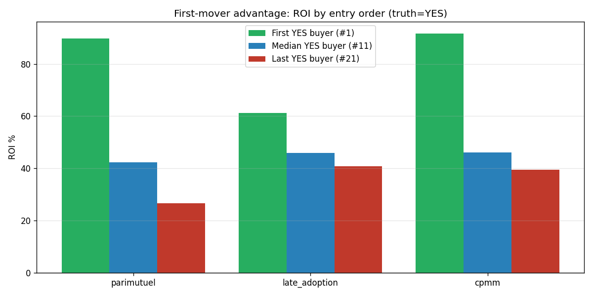

# Reputation System — What We Tried, What Works

Auto-built by `simulator.py`. Re-run any time to refresh.

> All numbers below come from `python3 simulator.py`. The simulator implements the three numbered models that have working math (C, D, E). Models A and B were rejected on paper before any code was written.

## All the models we discussed

Numbering kept consistent with the [v1 wiki page](https://github.com/ArdaSaygan/VeriFi/wiki/Reputation-Score-System) and [Arda's notes.md on the rep_score_simulator branch](https://github.com/ArdaSaygan/VeriFi/blob/rep_score_simulator/report/Rep%20Score%20Simulation/notes.md).

| # | Name | Where it came from | Status |
|---|---|---|---|
| **A** | Accuracy-score formula | v1 wiki (Reputation-Score-System) | ❌ rejected — needs hand-tuned per-asset coefficients, no social layer |
| **B** | Rep + airdropped token | v1 wiki (Reputation-Score-System) | ❌ rejected as redundant in v1; revisited as Model F below |
| **C** | Split-the-pot (parimutuel) | v1 wiki — currently implemented | ⚠ has the late-adoption and copy-trade problems |
| **D** | Late-adoption variant of C | Arda's `notes.md` on `rep_score_simulator` | ✅ fixes the late-loss problem but not the copy-trade dilution |
| **E** | Stock-market-style (CPMM) | This branch — new proposal | ✅ fixes both problems; reward is locked when you bet |
| **F** | E + daily energy token | This branch | ✅ E plus a daily activity cap so the leaderboard stays competitive |
| **G** | F + creator-funded pool + trivial refund | This branch — **actual final pick** | ✅ closes trivial-claim farming; creator funds the pool depth they want |

This report focuses on C, D, E, and F. A and B were dropped before implementation — see the v1 wiki for the original reasoning. **Model G is the final recommendation** — see `model_g_report.md` for full analysis.

## In one paragraph

We compared **Model C** (the current split-the-pot system), **Model D** (Arda's late-adoption fix), and **Model E** (a stock-market-style payout). Model C punishes people who join late even when they're right, and lets piggybackers steal the original predictor's reward. Model E fixes both — your reward is locked the moment you click Buy. v2 keeps the existing rules **fixed 10-rep stake, 1 bet per user per claim**, so whales literally cannot exist. We add a **daily energy token** to stop the leaderboard from running away from new users (Model F). We then harden the system further with **Model G**: the creator funds the pool depth at claim creation (picking X rep in [10, 100]) and the system refunds all stakes if a claim is trivially one-sided (<3 distinct dissenters or <5 total stakers). **Final pick: Model G = Model F + creator-funded pool seed + refund-if-trivial.**

## What each payout model does (plain words)

**Model C — split-the-pot (the current system).** Like a horse-track betting pool. Everyone who picks the winning side splits all the rep that was bet. The more people who picked your winning side, the smaller your slice. Earlier buyers get bigger slices because of an internal weight formula.

**Model D — late-adoption variant (Arda's idea).** Same as C, but winners get back their own 10 rep guaranteed, then split *only the losers'* rep. Stops you from losing rep when you're right but late.

**Model E — stock-market-style (CPMM, Polymarket).** Like a stock market. Each claim has a YES share price and a NO share price (always summing to 1). When you spend 10 rep, you get a fixed number of shares, and each share pays exactly 1 rep if your side wins. Your maximum reward is decided the moment you buy. New buyers move the price for *future* buyers, not for you.

**Model F — Model E + daily energy token.** Same payouts as E, plus a separate daily allowance (`energy`) that limits how many bets each user can place per day. Energy is not bought, sold, or earned — it just shows up at midnight. Stops high-skill users from owning the leaderboard within days.

Tiny example for Model E: claim is at YES = 50%. You spend 10 rep on YES. The system gives you ~19.2 YES shares. If YES wins → you get 19.2 rep (profit +9.2). If a friend buys 10 more YES after you, the price climbs to ~58%. **You still get 19.2 rep.** Your friend gets fewer shares because they paid a higher price. That's the whole idea.

## Scenario 1 — sanity check

**Story:** 100 random users, half pick YES half pick NO, no skill, coin-flip outcome. Just to make sure none of the models break.

> *Gini = 0–1 inequality measure (0 = everyone equal, 1 = one user has everything). Lower is more even.*

| Model | Profit spread (Gini) | People right but lost rep | Avg profit |
|---|---|---|---|
| C — split-the-pot | 0.52 | 0% | -0.00 |
| D — late-adoption (Arda) | 0.51 | 0% | -0.00 |
| E — stock-market (CPMM) | 0.52 | 0% | +0.32 |

**Takeaway:** all three behave normally on a fair coin flip. The interesting differences show up in the next scenarios.

## Scenario 2 — "I was right but I lost rep"

**Story:** Imagine claim *"BTC up 10% this week"*. 5 skeptics jump on NO early when the price is 50/50. Then 50 latecomers see the news and pile onto YES. BTC ends up going up — YES wins. How many of the 50 *correct* late-YES users still walk away with less rep than they started?

| Model | % of correct latecomers who LOST rep |
|---|---|
| **C** — split-the-pot (current) | **46%** ← almost half |
| **D** — late-adoption (Arda) | 0% |
| **E** — stock-market (CPMM) | **0%** ← nobody |

**Takeaway:** under today's parimutuel, ~46% of people who bet on the winning side *still lost rep* because their slice of the pool was tiny vs the early stakers. With CPMM, every correct buyer profits — just less if they bought late (price was already high). That's fair: you get rewarded more for being early *and* right, but never punished for being late *and* right.

## Scenario 3 — copying a smart trader (the piggyback problem)

**Story:** Famous trader Alice posts an early YES bet. Her 30 followers all copy her the next day. YES wins. Question: how much profit does Alice get?

| Model | Alice alone | Alice + 30 copiers | Drop in Alice's profit |
|---|---|---|---|
| C — split-the-pot | +100.0 rep | +3.9 rep | 96% |
| D — late-adoption (Arda) | +100.0 rep | +3.4 rep | 97% |
| E — stock-market (CPMM) | +9.2 rep | +9.2 rep | 0% |

**Takeaway:** Model C cuts Alice's reward by **96%** when 30 people copy her — she's punished for having followers. Model E cuts it by **0%** — her payout was locked the second she bought. Copiers still profit, just less per head because they bought at a worse price.

## Scenario 4 — going against the crowd

**Story:** 80 people scream YES, 20 quietly pick NO. NO is correct. How well do the 20 contrarians get paid?

| Model | Average contrarian profit | Best contrarian profit |
|---|---|---|
| C — split-the-pot | +40.0 rep | +50.1 rep |
| D — late-adoption (Arda) | +40.0 rep | +48.1 rep |
| E — stock-market (CPMM) | +17.1 rep | +18.4 rep |

**Takeaway:** Model C pays contrarians more rep in absolute numbers (they split a huge pool of losers among 20 people). Model E pays less per contrarian but it's fully predictable and never zero. Either model rewards the brave-and-right; C just rewards more loudly. We accept smaller numbers under E in exchange for the locked-reward guarantee.

## Scenario 5 — first-mover advantage (whales are impossible by design)

**Why no whale scenario:** v2 spec is **fixed 10 rep per stake, one position per user per claim, 1 ENERGY per stake**. A user cannot put more than 10 rep on any single claim no matter how rich they are. So "whale" reduces to "the same 10-rep buyer as everyone else." Whale problem doesn't exist. ✅

**What still exists is first-mover advantage.** Being early when price is near 50/50 gives you more shares per rep than being late when price is near 95%. That's a feature — it rewards conviction under uncertainty. We just want to make sure later buyers don't get *negative* returns when they're correct.

**Story:** 21 users buy YES one by one (each fixed 10 rep). Then 10 NO buyers come right at the end. Truth = YES.

| Model | First YES (#1) ROI | Median YES (#11) ROI | Last YES (#21) ROI |
|---|---|---|---|
| C — split-the-pot | +90% | +42% | +27% |
| D — late-adoption (Arda) | +61% | +46% | +41% |
| E — stock-market (CPMM) | +92% | +46% | +39% |

**Reading:** both models reward earlier buyers more, which is fair. The question is *how steep* the gradient is. Model C drops 90% → 27% (a 63-point gap); Model E drops 92% → 39% (52-point gap). Similar slope when the pool is balanced. The real difference shows up in scenario 2 (mostly winners, few losers): Model C goes *negative* for late buyers; Model E always stays positive — that's the locked-reward guarantee.

## Scenario 6 — does the leaderboard run away?

**Story:** simulate 30 days. 50 users with random skill levels. 20 claims open per day. Both runs use Model E payouts. We watch how spread out the rep balances become.

First run = **Model E alone** (no daily limit, you can bet on every claim). Second run = **Model F** (E + daily energy token, 3 staking-credits per day, save up to 4).

| Setup | Top user rep | Bottom user rep | Spread (Gini, lower = more even) |
|---|---|---|---|
| **E** alone (no daily limit) | 2710 | 1 | 0.64 |
| **F** (E + energy token) | 791 | 0 | 0.42 |

**Takeaway:** without the energy gate (Model E alone), the top user's rep balloons to **2710** — about **3.4× higher** than under Model F (791). The energy token doesn't stop skilled users from winning; it just caps how many bets they can place per day. The leaderboard stays competitive instead of being locked by a few power users on day 1.

## Quick-glance comparison

All four assume v2 hard rules: fixed 10-rep stake, 1 bet per user per claim, 1 energy per bet.

| Problem | A (rejected) | B (rejected) | C (current) | D (Arda) | E (CPMM) | F (E + energy) |
|---|---|---|---|---|---|---|
| Right-but-late user loses rep | n/a | n/a | ❌ severe (46%) | ✅ fixed | ✅ fixed | ✅ fixed |
| Followers steal predictor's reward | n/a | n/a | ❌ (~96%) | ❌ | ✅ | ✅ |
| Reward known the moment you bet | n/a | n/a | ❌ | ❌ | ✅ | ✅ |
| Whale dominance | n/a | n/a | impossible (rule) | impossible | impossible | impossible |
| Top users runaway leaderboard | n/a | n/a | ❌ | ❌ | ❌ | ✅ |
| House seed liquidity needed | — | — | — | — | small (~100 rep/claim) | small |
| Free daily token sybil risk | — | — | — | — | — | ⚠ needs 7-day account-age gate |

A: arbitrary per-asset accuracy formula. B: rep + token but with token gating *staking* (rejected as redundant). v1 wiki has the original A/B reasoning.

## Final recommendation — adopt Model G

Model G = Model F + creator-funded pool seed + refund-if-trivial.  See `model_g_report.md` for the full simulation analysis.

**1. Replace Model C (split-the-pot) with Model E (stock-market-style CPMM).**

- Each claim's pool is funded by the creator (see point 2 below). Initial price = 50/50.
- Each bet is **fixed 10 rep**, **1 bet per user per claim**, **1 energy per bet**. These rules make whales impossible.
- Buying YES with 10 rep gives you `10 + (Y+10)·10/(N+20)` YES shares.
- Each share pays 1 rep if your side wins, 0 if not. **Reward locked at buy time.**

**2. Creator funds the pool depth at claim creation (this is what G adds over F).**

- Creator picks X rep in [10, 100] and a starting side (YES or NO).
- X is deposited as X locked shares on the chosen side; system mirrors X as virtual liquidity on the opposite side. Pool starts Y = N = X.
- Creator also pays a **2-rep listing fee**, burned permanently (spam deterrent).
- Smaller X = thinner pool, less mint capacity, bigger price impact per stake. Larger X = deeper pool, smoother trading, higher mint cap. Creator picks the trade-off based on how contested they expect the claim to be.

**3. Refund-if-trivial.**

- At resolution, if the losing side has fewer than 3 distinct voters OR the claim attracted fewer than 5 stakers total, every stake is refunded in full.
- Trivial refund prevents one-sided "farming" claims from minting rep.

**4. Add a daily energy token (from Model F).**

- Every user gets 3 energy at midnight. Maximum balance = 4 (saving beyond 1 day is impossible).
- Betting on a claim costs 1 energy. Creating a claim costs 2.
- Energy is not tradeable, not refundable, not buyable.
- Effect: even the most active user can place ~3 bets/day. New users always have the same daily allowance as veterans.

**5. Stop new accounts from sybil-farming the energy.**

- First 7 days: only 1 ENERGY per day instead of 3.
- Email or Discord verification required to graduate to full daily grant.

**6. What this changes in the wiki/code.**

- Drop Model C's `weight = 1/entry_price` formula entirely.
- Replace `distribute_pool()` with `redeem_shares()` (1 rep per winning share) + refund path.
- Add `Position` model (replaces `ClaimStake`): `shares` field locked at bet time.
- Add `Claim.pool_seed` (X), `Claim.creator_side`, `Claim.listing_fee_burned` fields.
- Add `energy`, `energy_cap`, `last_grant` fields to `WalletUser`.
- Profile UI shows: rep, accuracy %, energy / cap.
- Claim card shows: live YES/NO price, *your locked payout if correct*, pool depth.

**7. Things we're keeping from the original spec.**

- Fixed 10-rep buy-in per trader (familiar UX). Variable amounts can be a v2.1 toggle.
- One position per user per claim, no exit before resolution.
- Creator no longer auto-stakes on YES — they pick side manually with their pool seed.

## Numbers in a nutshell

- Going from Model C to E cuts "right-but-lost" cases from **46% to 0%**.
- Going from C to E cuts copy-trade dilution from **96% to 0%**.
- Going from E to F (adding the energy token) compresses the leaderboard spread by **~34%** (Gini 0.64 → 0.42).
- Going from F to G cuts 180-day inflation drift from **+425% to +102%** (typical mix), and closes the trivial-claim farming attack.

## Things still to decide

- Public name of the energy token. Options: `Charge`, `Insight`, `Spark`, `Pulse`.
- Whether profile shows raw rep or a derived "truth score" (e.g. accuracy × log(rep)).
- Default pool seed X for new creators (suggest X=10 as conservative start).
- Cap on number of simultaneously open claims to bound platform's listing-fee revenue.
