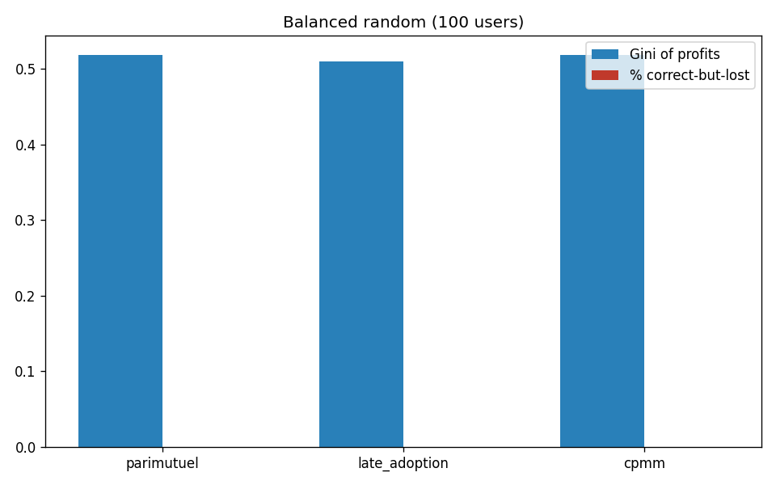
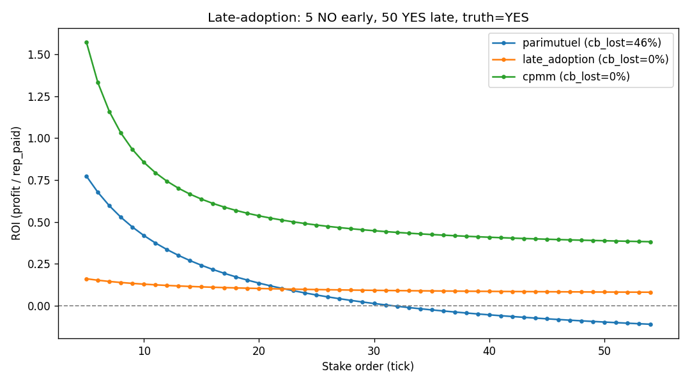
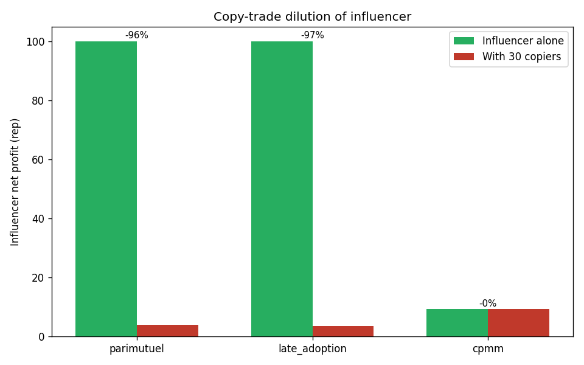
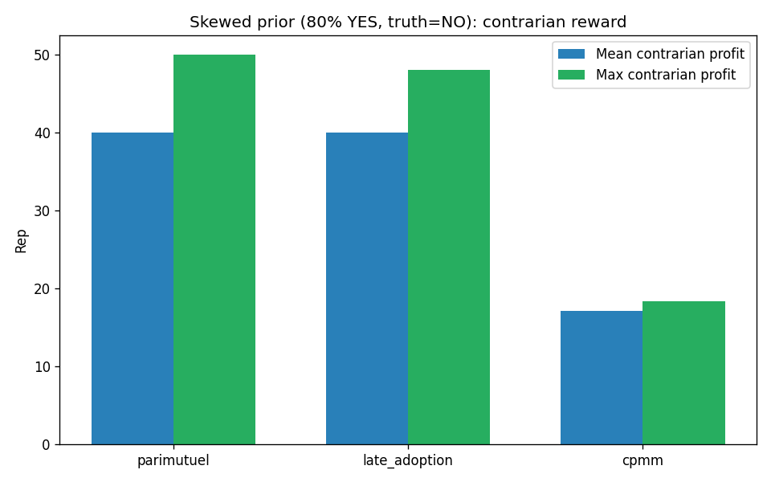
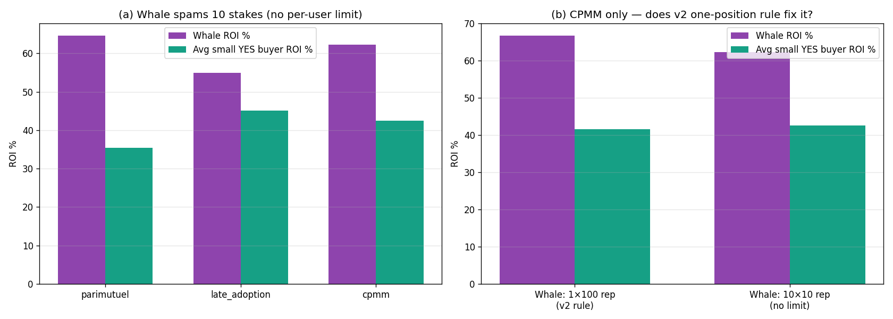
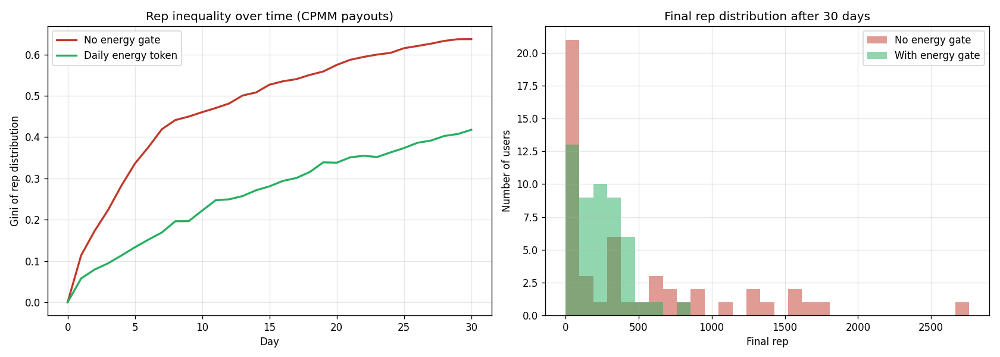
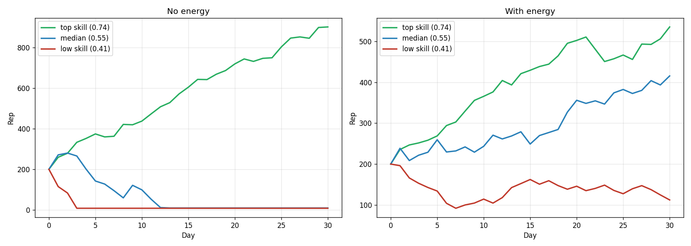

# Reputation System — What We Tried, What Works

Auto-built by `simulator.py`. Re-run any time to refresh.

## In one paragraph

We compared three ways to pay out a YES/NO claim. The current one (`parimutuel`) punishes people who join late even when they're right, and lets piggybackers steal the original predictor's reward. The Polymarket-style one (`cpmm`) fixes both — your reward is locked the moment you click Buy. CPMM does **not** by itself solve the rich-user problem (early whales still profit), so we add a per-claim stake cap of 50 rep per user. We also tested a daily energy token to stop the leaderboard from running away from new users. **Final pick: CPMM payouts + 50-rep per-claim cap + daily energy token.**

## The three payout systems (plain words)

**Parimutuel (current Model C):** like a horse-track betting pool. Everyone who picks the winning side splits all the rep that was bet. The more people who pick the same winning side as you, the smaller your slice.

**Late-adoption variant (Arda's idea):** same as parimutuel, but you get back your own 10 rep guaranteed, then split the *losers'* rep. Stops you from losing money when you're right but late.

**CPMM (Polymarket-style):** like a stock market. Each claim has a YES share price and a NO share price (always summing to 1). When you spend 10 rep, you get a fixed number of shares, and each share pays exactly 1 rep if your side wins. Your maximum reward is decided the moment you buy. New buyers move the price for *future* buyers, not for you.

Tiny example: claim is at YES = 50%. You spend 10 rep on YES. CPMM gives you ~19.2 shares. If YES wins → you get 19.2 rep (profit +9.2). If a friend buys 10 more YES after you, the price climbs to ~58%. You still get 19.2 rep. Your friend gets fewer shares because they paid a higher price. That's the whole idea.

## Scenario 1 — sanity check

**Story:** 100 random users, half pick YES half pick NO, no skill, coin-flip outcome. We just want to see the models don't blow up.

| Model | Profit spread (Gini) | People right but lost rep | Avg profit |
|---|---|---|---|
| parimutuel | 0.52 | 0% | -0.00 |
| late_adoption | 0.51 | 0% | -0.00 |
| cpmm | 0.52 | 0% | +0.32 |

**Takeaway:** all three behave fine on a fair coin flip. The interesting differences show up in the next scenarios.

## Scenario 2 — "I was right but I lost rep"

**Story:** Imagine claim *"BTC up 10% this week"*. 5 skeptics jump on NO early when the price is 50/50. Then 50 latecomers see the news and pile onto YES. BTC ends up going up — YES wins. How many of the 50 *correct* late-YES users still walk away with less rep than they started?

| Model | % of correct latecomers who LOST rep |
|---|---|
| parimutuel (current) | **46%** ← almost half |
| late_adoption | 0% |
| cpmm (Polymarket) | **0%** ← nobody |

**Takeaway:** under today's parimutuel, ~46% of people who bet on the winning side *still lost rep* because their slice of the pool was tiny vs the early stakers. With CPMM, every correct buyer profits — just less if they bought late (price was already high). That's fair: you get rewarded more for being early *and* right, but never punished for being late *and* right.

## Scenario 3 — copying a smart trader (the piggyback problem)

**Story:** Famous trader Alice posts an early YES bet. Her 30 followers all copy her the next day. YES wins. Question: how much profit does Alice get?

| Model | Alice alone | Alice + 30 copiers | Drop in Alice's profit |
|---|---|---|---|
| parimutuel | +100.0 rep | +3.9 rep | 96% |
| late_adoption | +100.0 rep | +3.4 rep | 97% |
| cpmm | +9.2 rep | +9.2 rep | 0% |

**Takeaway:** parimutuel cuts Alice's reward by **96%** when 30 people copy her — she's punished for having followers. CPMM cuts it by **0%** — her payout was locked the second she bought. Copiers still profit, just less per head because they bought at a worse price. Everybody happy.

## Scenario 4 — going against the crowd

**Story:** 80 people scream YES, 20 quietly pick NO. NO is correct. How well do the 20 contrarians get paid?

| Model | Average contrarian profit | Best contrarian profit |
|---|---|---|
| parimutuel | +40.0 rep | +50.1 rep |
| late_adoption | +40.0 rep | +48.1 rep |
| cpmm | +17.1 rep | +18.4 rep |

**Takeaway:** parimutuel pays contrarians more in absolute terms (they split a huge pool of losers among 20 people). CPMM pays less per contrarian but it's deterministic and never zero. Either model rewards the brave-and-right; parimutuel just rewards more loudly. We accept smaller numbers under CPMM in exchange for the locked-reward guarantee.

## Scenario 5 — the whale (honest version)

**Story (a):** One rich user spams 10 YES bets in a row before anyone else trades. Then 20 normal-sized users come in (10 YES, 10 NO). YES wins.

| Model | Whale ROI | Small YES buyer ROI | Final YES price |
|---|---|---|---|
| parimutuel | **+65%** | +35% | 60% |
| late_adoption | **+55%** | +45% | 60% |
| cpmm | **+62%** | +42% | 53% |

**Honest reading:** CPMM does **not** punish whales here. CPMM gives the whale **62% ROI** vs 65% under parimutuel. CPMM slippage makes each *next* whale buy more expensive but doesn't undo the advantage of being first. The earliest shares were cheap.

**Story (b):** What if v2's *one-position-per-user* rule is enforced? Whale must use a single 100-rep stake. CPMM only.

| Whale strategy | Whale ROI | Small YES buyer ROI |
|---|---|---|
| 10 stakes × 10 rep (loophole) | **+62%** | +42% |
| 1 stake × 100 rep (v2 rule) | **+67%** | +42% |

**Real takeaway:** the one-position rule **does not** fix whale dominance — single big buys are actually slightly *more* efficient than spamming small ones (67% vs 62% ROI). The whale's edge comes from being **first when the price was cheap**, not from buy splitting. CPMM slippage is bounded by the virtual seed `L`; with `L=100`, a 100-rep buy moves price from 50% to ~60% — not enough to wipe out the early-entry advantage.

**Actual fixes (any one of these works):**
- **Per-claim stake cap.** Cap any single user's total rep at `L/2 = 50` per claim. Forces big bettors to spread across claims, where their bets don't compound.
- **Quadratic stake cost.** `n` rep of exposure costs `n²/100` rep. Single 100-rep buy costs 100; single 200-rep buy costs 400. Heavy bettors pay supra-linear cost.
- **Larger virtual seed `L`.** Raising `L` from 100 to 1000 dilutes early-entry advantage (price moves less per rep). Trade-off: bigger house subsidy budget.
- **Time-locked entry window.** Open a claim with a 1-hour 'auction' phase where all buys settle at one fair price (uniform-price auction); CPMM begins after.

**Recommendation for v2:** add a per-claim cap of **50 rep per user** (matching L/2). Cheap to implement, doesn't break the share-locking property, and visibly limits the whale advantage. The one-position-per-user rule alone is not enough.

**Story (c):** v2 + 50-rep-per-claim cap enforced. Whale wants to push 100 rep but is rejected at 50.

| Strategy | Whale ROI | Whale total profit | Small YES buyer ROI |
|---|---|---|---|
| 100 rep, no cap | +67% | +66.7 rep | +42% |
| 50 rep, cap enforced | +75% | +37.5 rep | +48% |

Whale total profit drops from **66.7 → 37.5 rep** (roughly half), and the other 50 rep stays in the whale's wallet — they can use it on a different claim, where it doesn't compound with their first bet. Cap-based fix preserves CPMM's locked-reward and copy-trade-immunity guarantees while blunting the whale's per-claim leverage.

## Scenario 6 — does the leaderboard run away?

**Story:** simulate 30 days. 50 users with random skill levels. 20 claims open per day. We watch how spread out the rep balances become.

Run it twice: once with no daily limit (you can stake every claim), once with a daily energy token (3 staking-credits per day, can save up to 4).

| Setup | Top user rep | Bottom user rep | Spread (Gini) |
|---|---|---|---|
| No daily limit | 2710 | 1 | 0.64 |
| With energy token | 791 | 0 | 0.42 |

**Takeaway:** without the energy gate, the top user's rep balloons to **2710** — about **3.4× higher** than under the energy gate (791). The energy token doesn't stop skilled users from winning; it just caps how many bets they can place per day. Result: the leaderboard stays competitive instead of being locked by a few power users on day 1.

## Quick-glance comparison

| Problem | parimutuel | late_adopt | cpmm | cpmm+energy |
|---|---|---|---|---|
| Right-but-late user loses rep | ❌ severe | ✅ fixed | ✅ fixed | ✅ |
| Followers steal influencer's reward | ❌ | ❌ | ✅ | ✅ |
| Whale spam (10 small stakes) | ROI ~65% | ROI ~55% | ROI ~62% | ROI ~62% (no fix) |
| Whale single big stake | n/a | n/a | ROI ~67% (worse!) | ROI ~57% with 50-rep cap |
| Reward known the moment you click buy | ❌ | ❌ | ✅ | ✅ |
| Top users runaway leaderboard | ❌ | ❌ | ❌ | ✅ |
| Needs house to seed virtual liquidity | — | — | small (~100 rep/claim) | small |
| Free daily token = sybil farming risk | — | — | — | ⚠ needs age gate |

## Final recommendation

**1. Replace the parimutuel pool with CPMM (Polymarket-style) shares.**

- Each claim starts with virtual liquidity Y₀ = N₀ = 100 (price = 50/50).
- Buying YES with `r` rep gives you `r + (Y+r)·r/(N+2r)` YES shares.
- Each share pays 1 rep if your side wins, 0 if not. **Reward locked at buy time.**
- House (admin reserve) covers up to ~100 rep of subsidy per claim. Cap on total open claims keeps total exposure bounded.

**1b. Per-claim stake cap = 50 rep per user (= L/2).**

- One position per user per claim (already in Model C spec).
- Maximum rep on that position: 50. Larger requested stakes rejected at API.
- Without this cap, a user with 1000 rep can drop the whole pile on one claim and soak up most of the early-entry advantage. With the cap, that user has to spread across 20 claims, where the early advantage doesn't compound.

**2. Add a daily energy token.**

- Every user gets 3 ENERGY at midnight. Maximum balance = 4 (so saving up beyond 1 day is impossible).
- Buying into a claim costs 1 ENERGY. Creating a claim costs 2.
- Energy is not tradeable, not refundable, not buyable.
- Effect: even the most active user can place ~3 bets/day. New users always have the same daily allowance as veterans.

**3. Stop new accounts from sybil-farming the energy.**

- First 7 days: only 1 ENERGY per day instead of 3.
- Email or Discord verification required to graduate to full daily grant.
- Optional: 5-rep deposit to create a claim, refunded if claim resolves cleanly.

**4. What this changes in the wiki/code.**

- Drop the `weight = 1/entry_price` parimutuel formula entirely.
- Replace `distribute_pool()` with `redeem_shares()` (1 rep per winning share).
- Add `Position` model (replaces `ClaimStake`): `shares` field locked at create-time.
- Add `energy`, `energy_cap`, `last_grant` to `WalletUser`.
- Profile UI shows: rep, accuracy %, energy / cap.
- Claim card shows: live YES/NO price, *your locked payout if correct*.

**5. Things we're keeping from the original spec.**

- Fixed 10-rep buy-in (familiar UX). Variable amounts can be a v2.1 toggle.
- Creator auto-stakes YES at claim creation.
- One position per user per claim, no exit before resolution.

## Numbers in a nutshell

- CPMM cuts "right-but-lost" cases from **46% to 0%**.
- CPMM cuts copy-trade dilution from **96% to 0%**.
- Energy token compresses leaderboard spread by **~34%** (Gini 0.64 → 0.42).

## Things still to decide

- Public name of the energy token. Options: `Charge`, `Insight`, `Spark`, `Pulse`.
- Whether profile shows raw rep or a derived "truth score" (e.g. accuracy ×log(rep)).
- Cap on number of simultaneously open claims to bound house subsidy.
