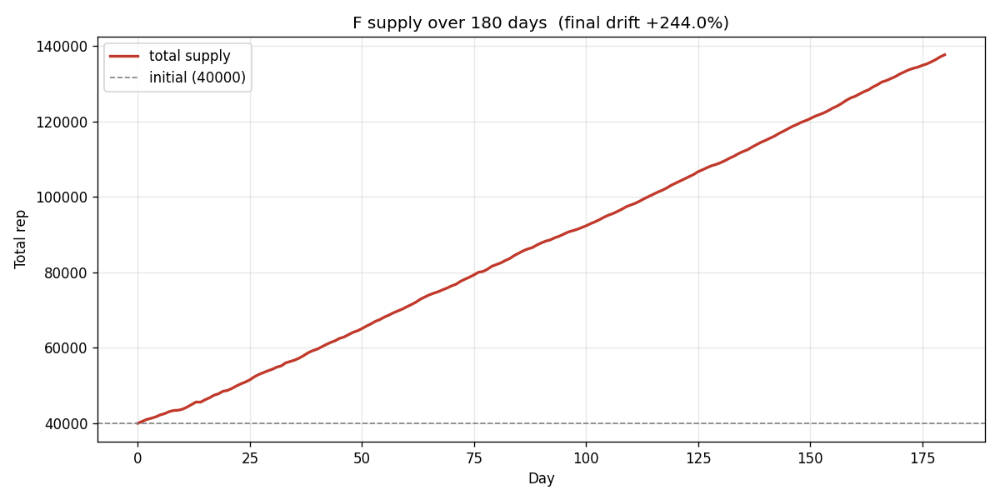
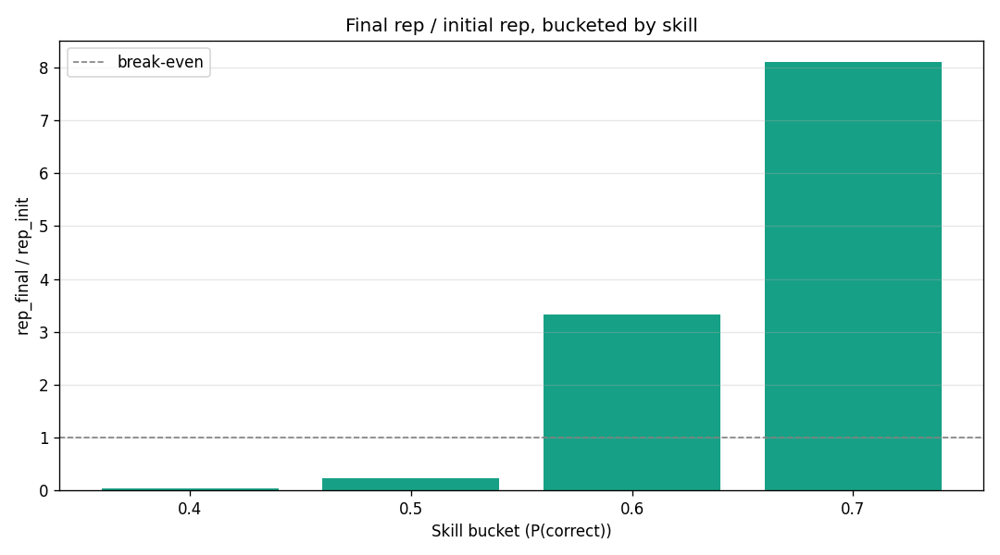
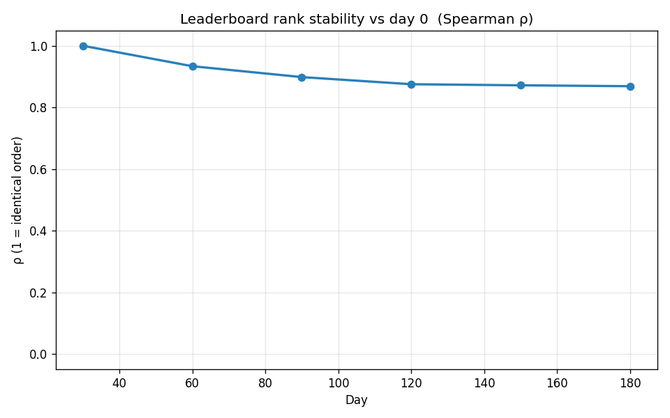
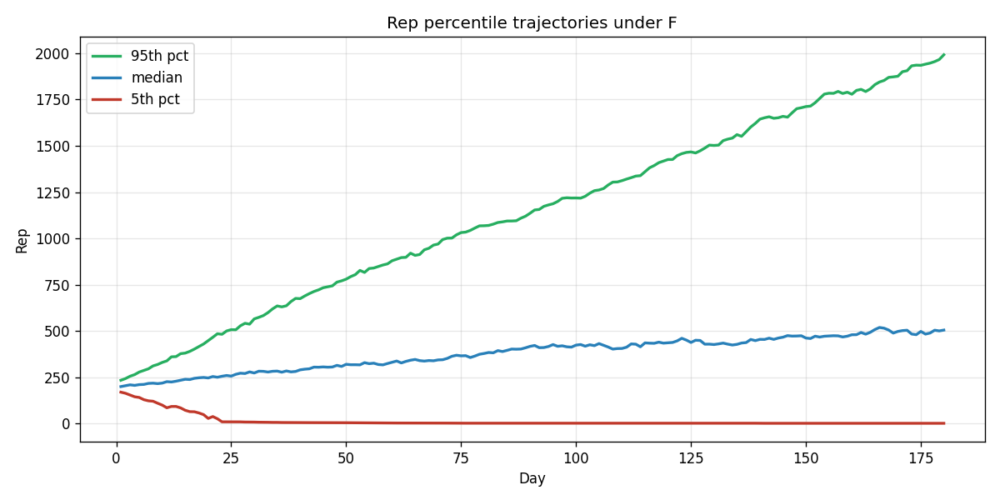
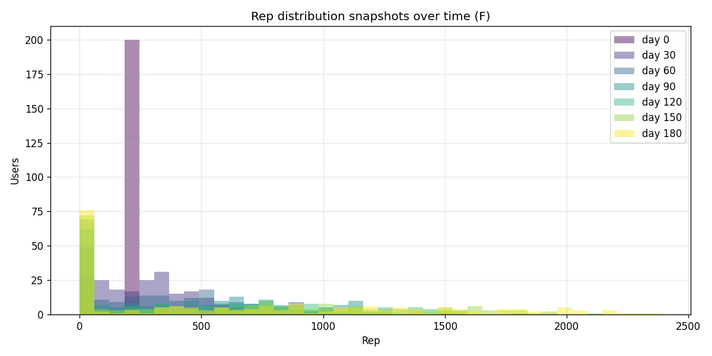

# Is Model F's inflation a problem in practice?

Built by `simulator_inflation.py`. Realistic conditions: 180 days, 200 users, 10 claims/day, energy gate active (3 grant, cap 4), random skill in [0.40, 0.75], random activity in [0.20, 1.00].

## Headline numbers

- Total supply (F, INIT_L=100): **40000 → 137612**  (drift **+244.0%** over 180 days)
- Same conditions, F with INIT_L=10 (smaller subsidy): drift **+194.1%**
- Same conditions, G (zero-sum): drift **-0.3%**
- Implied daily inflation rate: **0.689%/day**
- Equivalent monthly: **22.87%/mo**
- Equivalent annualised: **1124.9%/yr**

## Q1 — Is the rate fast enough to notice?

At 22.87%/mo … by analogy, USD inflation runs ~0.2–0.4%/mo (2024). VeriFi is much higher. Users who log in monthly will see their balance grow even on break-even play. Whether that's bad depends on Q2-Q4.

## Q2 — Is inflation uniform or concentrated?

Per-skill-tier final/initial rep ratio. If inflation is uniform, all tiers ride the same multiplier. If it's concentrated, only the top tier gets the gain.

| Skill bucket | Avg final / initial |
|---|---|
| 0.4 | 0.03× |
| 0.5 | 0.24× |
| 0.6 | 3.33× |
| 0.7 | 8.11× |

Spread across buckets: **8.08×**. Concentrated — top tier benefits much more.

## Q3 — Does the leaderboard order stay stable?

Spearman ρ between day-0 ranking and ranking at day d:

| Day | ρ vs day 0 |
|---|---|
| 30 | +1.000 |
| 60 | +0.934 |
| 90 | +0.898 |
| 120 | +0.875 |
| 150 | +0.872 |
| 180 | +0.869 |

Final ρ = **+0.869**. Order is preserved — inflation is just a units change.

## Q4 — Threshold drift

- Median user: 200 → **505** rep
- 95th percentile: **1991**
- 5th percentile: **2**

A newcomer joining at day 180 with 200 starting rep sits at the bottom half by absolute number. If the UI displays raw rep, this is misleading; if it displays percentile rank or 'truth score = accuracy×log(rep)', the absolute drift is irrelevant.

## Verdict

**Genuinely problematic.** Fix at the protocol level (Model G's zero-sum or a rebase mechanism).

### Cheap fixes that don't require Model G

- **Percentile display.** Show "top 12%" instead of "3812 rep". Inflation invisible.
- **Truth Score = accuracy × log(rep + 1).** log compresses the inflation; relative ordering preserved.
- **Annual rebase.** Multiply every balance by `target_total / current_total` at midnight on Jan 1. Same as a stock split.
- **Slow burn fee.** 0.5% of every stake routed to /dev/null instead of pool. Tune to match expected mint.
- **House sink.** Listing bonuses, sybil-stop deposits, claim-creation fee — all paid from pool, drain inflation.
