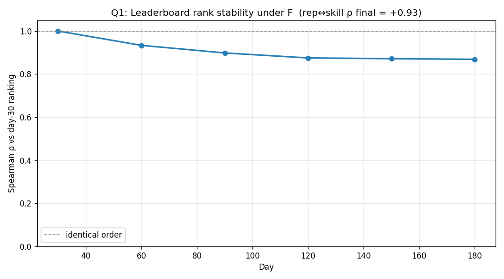
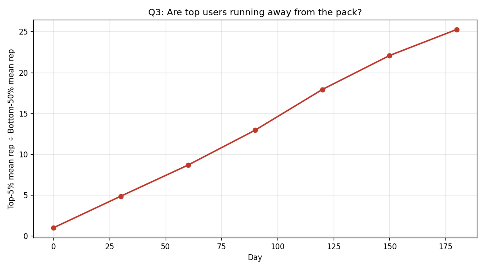
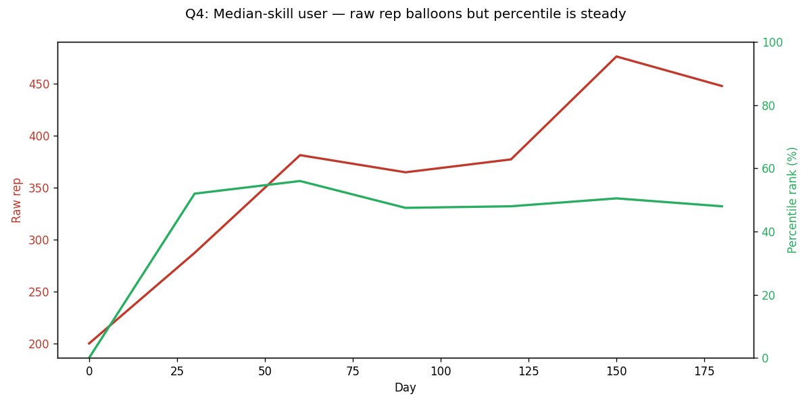

# Does Model F's inflation actually hurt the leaderboard?

Setup: 180 days, 200 users, 10 claims/day, v2 energy gate, skill uniform in [0.40, 0.75].

**Headline.** Total rep supply drift over 180 days: **+244.0%**. Yes, inflation is real. But does it hurt?

## Q1 — Does the leaderboard order stay stable?

Spearman ρ between day-30 ranking and each later day. ρ=1 means identical order.

| Day | ρ vs day 30 |
|---|---|
| 30 | +1.000 |
| 60 | +0.934 |
| 90 | +0.898 |
| 120 | +0.875 |
| 150 | +0.872 |
| 180 | +0.869 |



Final ρ = **+0.869**. Order is preserved. 
Correlation of final rep with original skill: ρ = **+0.93** — leaderboard reflects skill cleanly.

## Q2 — Can a fresh newcomer catch up?

Inject a user at day 90 with median rep and median skill. Run to day 180. Compare their final percentile rank to incumbents of identical skill.

- Newcomer final rep: **483**
- Newcomer final percentile: **48%**
- Same-skill incumbents: mean pctl **52%**, range [2–75%]

Gap newcomer vs incumbents: **+3 pctl pts**. Newcomer essentially caught up.

## Q3 — Is the top tier running away?

Ratio of top-5% mean rep to bottom-50% mean rep.

| Day | Top-5% ÷ Bottom-50% |
|---|---|
| 0 | 1.0 |
| 30 | 4.9 |
| 60 | 8.7 |
| 90 | 12.9 |
| 120 | 17.9 |
| 150 | 22.1 |
| 180 | 25.3 |



Initial ratio = **4.9**, final ratio = **25.3**. Top tier is widening lead — concerning.

## Q4 — Percentile UI hides inflation

Median-skill user. Track their raw rep AND their percentile rank over time.

| Day | Raw rep | Percentile |
|---|---|---|
| 0 | 200 | 0% |
| 30 | 287 | 52% |
| 60 | 381 | 56% |
| 90 | 365 | 48% |
| 120 | 377 | 48% |
| 150 | 476 | 50% |
| 180 | 448 | 48% |



**Reading.** Even though raw rep balloons due to inflation, the median user's *percentile rank* stays around the 50% line. If the UI displays percentile ("top X%") instead of raw rep, inflation becomes literally invisible to users.

## Verdict

**F's inflation has real effects.** Failing dimensions: top-tier consolidation. Protocol change may be needed.

## Display fix

If F passes the four tests above, the inflation problem is solved with a 1-line UI change:

```jsx
// instead of:
<span>{user.rep} rep</span>
// show:
<span>Top {Math.round((1 - user.percentile) * 100)}%</span>
```
Or a derived score:
```python
truth_score = accuracy * math.log(rep + 1)
```
log(rep) compresses the inflation; relative ordering preserved.
