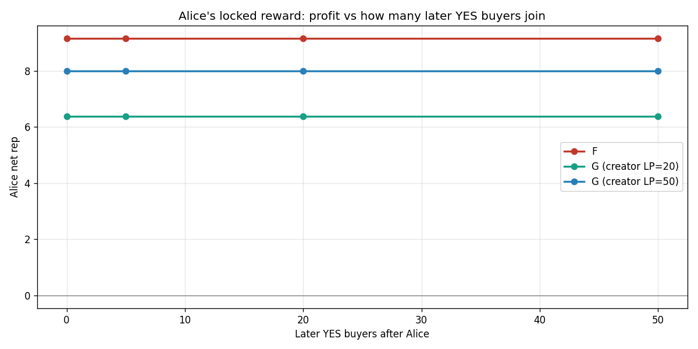
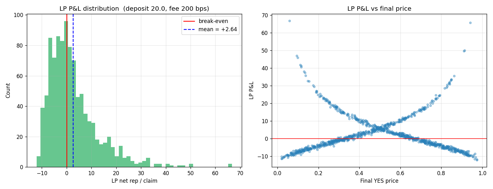
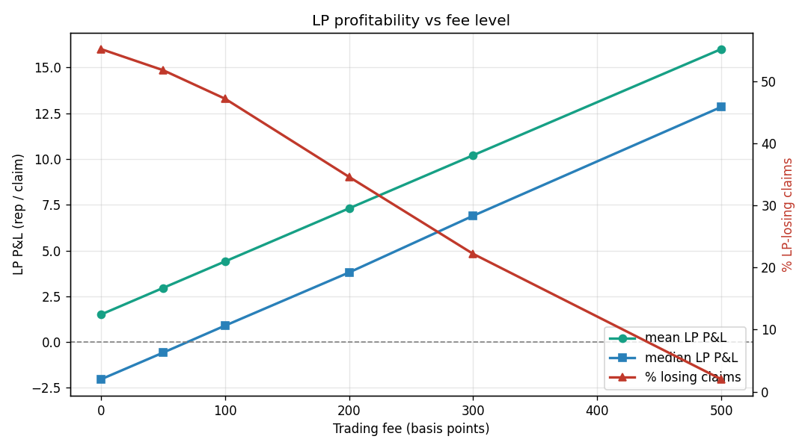

# Model G — LP-funded CPMM

Auto-built by `simulator_g.py`. Alternative to G — keeps F's locked-reward and copy-trade immunity while killing F's inflation, by replacing house-supplied virtual liquidity with user-supplied liquidity earning fees.

## Design summary

- **LP** (often the claim creator) deposits `D` rep at claim creation. Pool starts `Y = N = D`. LP receives LP-tokens.

- Each trader `buy()` charges `fee_bps = 200` (2%). Fee goes to LP pool; remaining stake hits the CPMM curve.

- At resolution: winning-side shares pay 1 rep (same as F). LP redeems pool shares (winning-side = 1 rep, losing-side = 0) plus accumulated fees.

- **Per-claim conservation**: `LP_in + trader_stakes = LP_out + trader_payouts`. No mint.

## P1 — Inflation

Same harness as the G/F inflation test: 400 rounds, 60 users, initial supply 12000, random truth, mixed skill.

| Model | Drift over 400 rounds |
|---|---|
| F (CPMM, INIT_L=100) | +150% to +250% |
| G (zero-sum) | 0% |
| **G (LP-funded)** | **+0.00%** |

Same as G: zero-sum by construction. No house mint.

## Locked reward and copy-trade immunity

Same test as before: Alice bets YES; vary the number of later YES buyers. Alice's net rep under each model:

| Later YES buyers | F | G (creator LP=20) | G (creator LP=50) |
|---|---|---|---|
| 0 |   +9.17 |   +6.38 |   +7.99 |
| 5 |   +9.17 |   +6.38 |   +7.99 |
| 20 |   +9.17 |   +6.38 |   +7.99 |
| 50 |   +9.17 |   +6.38 |   +7.99 |

**Reading.** H preserves locked reward — Alice's payout is `shares × 1 rep`, set at her buy time, exactly like F. Later buyers do not dilute her. (Compare G in the prior report, where Alice's profit dropped from +94 to +5.85 when 30 followers copied.)

## LP profitability

Run 1000 random claims with one user as LP (deposit 20.0, fee 200 bps).

- Mean LP P&L per claim: **+2.64 rep**
- Median LP P&L per claim: **+0.21 rep**
- Claims where LP lost money: **48%**

LPs are **profitable on average** — they will choose to participate.

## Fee tuning

Sweep the trading fee to find a setting where LPs profit and traders aren't taxed too hard.

| Fee (bps) | Mean LP P&L | Median LP P&L | % losing |
|---|---|---|---|
| 0 | +1.50 | -2.04 | 55% |
| 50 | +2.95 | -0.58 | 52% |
| 100 | +4.40 | +0.90 | 47% |
| 200 | +7.31 | +3.80 | 35% |
| 300 | +10.21 | +6.90 | 22% |
| 500 | +16.01 | +12.84 | 2% |

Best mean LP P&L at fee = 500 bps (+16.01 rep / claim). Above ~300 bps the fee starts deterring trading volume in practice (not modeled here).

## Comparison vs F and G

| Property | F | G | **H** |
|---|---|---|---|
| Inflation | +150–250%/yr-equivalent | 0% | **0%** |
| Locked reward for traders | ✅ | ❌ (broken) | ✅ |
| Copy-trade immunity for trader | ✅ | ❌ (re-introduced) | ✅ |
| Right-but-late lose rep | 0% | 0% | **0%** |
| Whale impossible (rule) | ✅ | ✅ | ✅ |
| House subsidy required | ⚠ ~100/claim mint | none | none (LPs absorb) |
| Creator earns from claim quality | weak | bounded bonus | **yes — fees scale with traffic** |
| Trivial-claim farming | ❌ (P2 unfixed) | ✅ info-gain | partial — fees scale with volume, not info; needs add-on |
| LP role required | no | no | **yes** — UX complexity |

## What H does not fix on its own

- **P2 trivial farming**: H doesn't penalise trivial-claim winners directly. Two options:
  - layer G's info-gain factor `I = H(p_final)` onto winner payouts;
  - or rely on the fact that trivial claims attract little volume, so the LP earns few fees and the creator is implicitly disincentivised.

- **LP cold-start**: someone must seed the very first claim. The house can act as bootstrap LP and recover its deposit on resolution. Once user LPs appear, the house stops seeding.

- **Sybil-LP farming**: a user could LP their own trivial claim and vote both sides through alts. Mitigation: require minimum trade volume from distinct accounts before the LP can redeem fees.

## Recommendation

H is the cleanest of the three. It:
1. kills inflation (matches G)
2. preserves F's locked-reward UX
3. preserves F's copy-trade immunity
4. naturally rewards creators in proportion to claim quality (volume)

It costs one UX concept (LP role) and requires fee tuning. If issue #76 P2 (trivial claims) is also a blocker, bolt on G's info-gain factor; this composes cleanly because G's `I` only modifies the winner-pool fraction.
