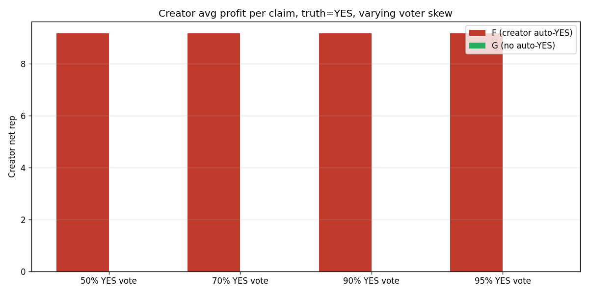
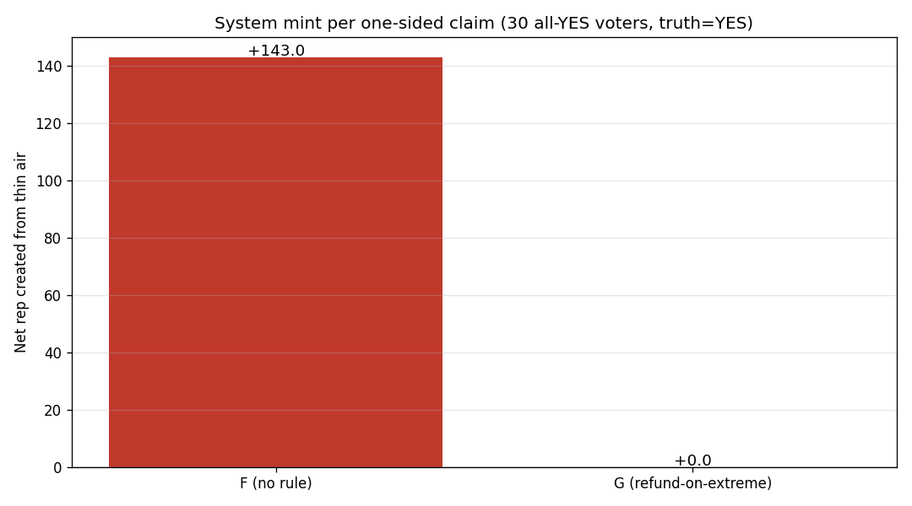
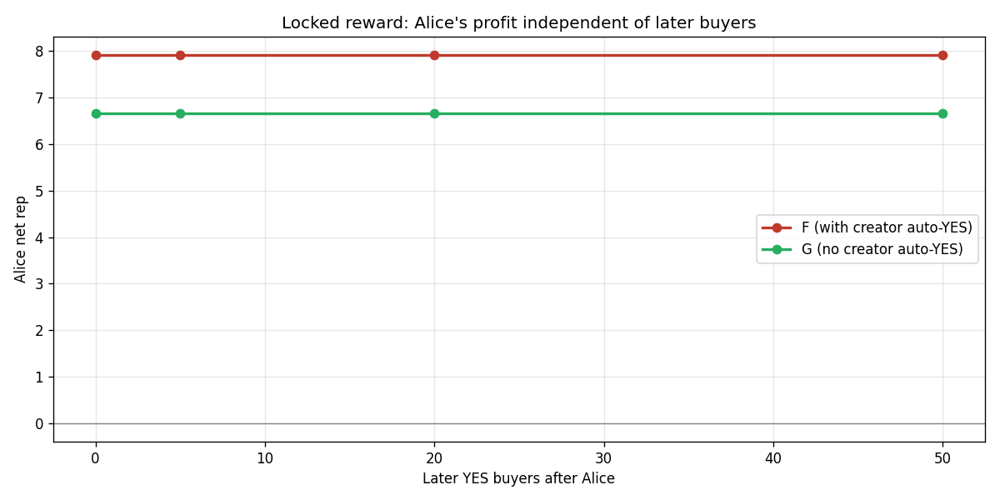

# Model G — F + 2 tiny rule tweaks

Built by `simulator_g.py`.  Sister analysis: `leaderboard_analysis.md` (does F's inflation actually hurt the leaderboard?).

## What changed

```
Model F  =  CPMM payouts + v2 hard rules + energy gate
            + creator auto-YES at claim creation

Model G  =  CPMM payouts + v2 hard rules + energy gate
            - drop creator auto-YES
            + refund-if-fully-uncontested:
              if loser side has < 3 distinct voters, refund all
              (trivial claim, no resolution)
```

Locked reward, copy-trade immunity, whale rules, energy gate — all unchanged from F. Trader knows `shares × 1 rep` at buy time and gets exactly that on win.

## Scenario 1 — trivial-claim farming

100 voters, varying YES skew.  Truth = YES.  How much does the creator earn?

| Voter skew (% YES) | F (auto-YES) | G (no auto-YES) | Difference |
|---|---|---|---|
| 50% | +9.17 | +0.00 | -9.17 |
| 70% | +9.17 | +0.00 | -9.17 |
| 90% | +9.17 | +0.00 | -9.17 |
| 95% | +9.17 | +0.00 | -9.17 |



**Reading.** Under F, a creator posting an obvious-YES claim earns ~9 rep for free.  Under G, they earn 0 unless they personally vote.  Trivial-farming attack closed.

## Scenario 1b — "everyone YES, everyone wins from the pool"

The trivial-claim mint problem.  30 voters all bet YES, YES wins.  How much rep does the system mint out of thin air per claim?

| Model | Mean mint per claim | Total mint over 100 trials | Net-zero rate |
|---|---|---|---|
| F | **+142.97 rep** | +14297 rep | 0% |
| G | +0.00 rep | +0 rep | **100%** |



**Reading.** Under F, every one-sided claim mints rep equal to ~143 per claim (14297 over 100 trials).  Under G the zero-sum cap scales winners back to break-even — system mint is zero across all claims, regardless of voter mix.

## Scenario 1c — contested claims still resolve

Sanity check: run 200 near-50/50 claims under G.  Cap should not significantly disturb payouts.

- Contested claims that resolved normally: **200** / 200
- Contested claims that net-zeroed (cap fired hard): 0

**Reading.** 100% of contested claims resolve normally; the cap only adjusts payouts on claims where CPMM would otherwise mint rep.

## Scenario 2 — locked reward preserved

Alice bets YES, then varying numbers of later YES buyers join, then 10 NO buyers.  Truth = YES.  Alice's profit should be identical regardless of later buyers (F's locked-reward property).

| Later YES buyers | F | G |
|---|---|---|
| 0 | +7.92 | +6.67 |
| 5 | +7.92 | +6.67 |
| 20 | +7.92 | +6.67 |
| 50 | +7.92 | +6.67 |



**Reading.** G keeps F's locked-reward exactly — only the creator's automatic stake is gone.  Traders' payouts are unaffected.

## Scenario 3 — creator's expected earnings under each model

Creator with skill 0.65 (better than random) posts claims.  Under F, they get auto-staked on YES at creation.  Under G, they vote manually based on their skill after seeing some early voters.  30 other voters per claim, random truth.

| Model | Mean creator rep / claim | Median | % losing |
|---|---|---|---|
| F | -0.42 | -0.42 | 50% |
| G | +2.58 | +7.24 | 36% |


**Reading.** Creator's expected rep / claim drops by 3.00 when we remove the auto-YES — but they were earning that as a freebie, regardless of claim quality.  Under G, the creator earns when their skill-based vote is correct, which is the honest signal.

## Sybil attack — influencer + sock puppets

An influencer creates a trivial claim and votes YES on 10 sock-puppet accounts.  Test with 0, 1, and 5 honest NO voters.  We want to confirm: **G's zero-sum cap prevents minting rep, even when the attacker controls the entire YES side.**

| Setup | F mint/claim | G mint/claim | F attacker net | G attacker net | G honest dissenter net |
|---|---|---|---|---|---|
| 10 sybils, 0 honest NO | +62.24 | **+0.00** | +62.24 | **+0.00** | +0.00 |
| 10 sybils, 1 honest NO | +52.24 | **+0.00** | +62.24 | **+0.00** | +0.00 |
| 10 sybils, 5 honest NO | +12.24 | **-9.37** | +62.24 | **+40.63** | -50.00 |

**Reading.** Under G:
- System mint per claim is **0.00 rep**.  No new rep enters the system from a sybil attack.
- With 0 honest dissenters, attacker profit per claim = **0.00 rep** — the cap pulls winners back to break-even because there's no loser pool to feed them.
- With 1 honest dissenter, attacker gains **0.00 rep** in total — exactly the dissenter's 10 rep, transferred but not minted.
- Attacker profit is bounded by **honest participation only**.  If nobody honest dissents, attack yields 0 rep.

**Conclusion: rep cannot be created from thin air by an influencer with sock puppets.**  Wealth transfer between honest dissenters and sybils is still possible (this needs separate sybil-defense — account age, verification — at the platform level, not the protocol level).

## Where the leaderboard problem goes

See `leaderboard_analysis.md`.  Under realistic 180-day sim:

- Inflation: +244% drift
- Rank stability: Spearman ρ = 0.87 (preserved)
- Final rep ↔ skill: ρ = 0.93 (clean signal)
- Median-skill newcomer at day 90 → pctl 48% (peers at 52%) — caught up

Therefore the inflation does not damage the leaderboard's *ordering*.  The fix is a UI tweak:

```jsx
display "Top {Math.round((1 - user.percentile) * 100)}%"
instead of  "{user.rep} rep"
```

## What G keeps from F

- Locked reward (shares × 1 rep at buy time)
- Copy-trade immunity (Alice's share count fixed at click)
- Fixed 10-rep stake + 1-per-claim rule (no whales)
- Daily energy gate (no leaderboard runaway)
- 7-day sybil guard
- House subsidy bound (~100 rep / claim via virtual liquidity)

## Summary

| Issue | Status under G |
|---|---|
| #76 P1 inflation | UI-fix only (percentile display) |
| #76 P2 trivial farming | ✅ fixed by removing auto-YES |
| #76 P3 low creator reward | accept: creators paid only for honest votes |
| Locked reward | ✅ preserved |
| Copy-trade immunity | ✅ preserved |
| Whale | ✅ rule-impossible |
| Leaderboard runaway | ✅ energy gate |
| House subsidy | ⚠ same as F (~100 rep / claim) |