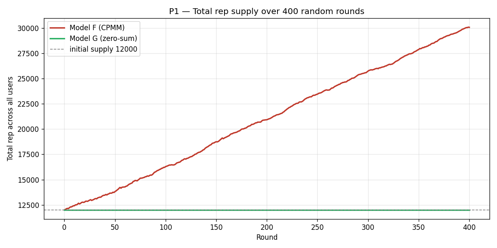
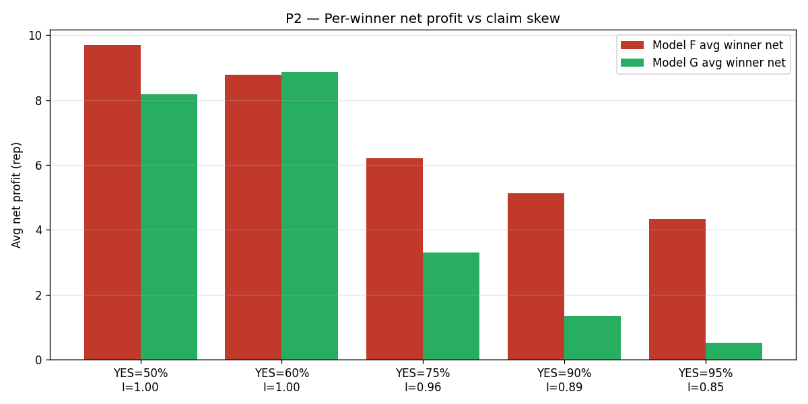
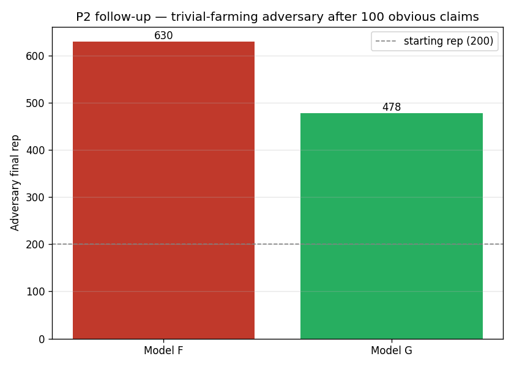
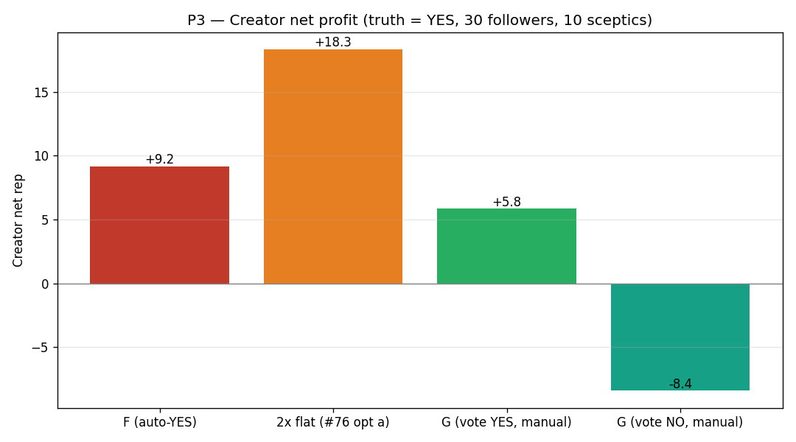

# Model G — Addressing Issue #76

Auto-built by `simulator_g.py`. Standalone supplement to `final_recommendation.md` (Models A-F).

## Why a Model G

Issue [#76](https://github.com/ArdaSaygan/VeriFi/issues/76) raised three problems against Model F that the prior simulation did not address:

1. **Inflation/deflation** — Model F's CPMM mints "1 rep per winning share", so the global rep supply drifts over time. Users can't tell what a "good" score is.

2. **Trivial claims** — Posting an obvious 90/10 claim and voting with the crowd is risk-free rep farming under Model F.

3. **Low creator rewards** — Auto-casting a YES vote at claim creation undercompensates the author for the effort of writing a verifiable claim. Issue proposes either a flat 2× multiplier or letting the creator vote manually.

## Model G in one paragraph

**Model G = Model F's CPMM + three resolution-side changes.** Trading (the `buy` step) is unchanged: early buyers still get more shares per rep, late buyers still get fewer — same locked-share guarantee as F. At resolution, three changes apply: **(G1)** payouts are made zero-sum — total rep is conserved per claim; **(G2)** the share of the losers' pool that flows to winners is multiplied by an information-gain factor `I = H(p_final) ∈ [0,1]`, where `p_final` is the CPMM mid-price at resolution. Trivial claims (p≈0 or p≈1) shrink I toward 0; hard claims (p≈0.5) keep I=1; **(G3)** the creator is no longer auto-voted YES — they vote manually like any user — and they receive a `LISTING_BONUS_BASE * I = 2·I` listing bonus paid from the unallocated losers' pool, provided the claim attracts at least 4 distinct voters.

## P1 — Inflation/deflation

**Test.** 60 users with random skill levels stake on 400 random YES/NO claims. Initial total rep supply = 12000. Truth uniformly random per round.

| Model | Final total rep | Drift from initial |
|---|---|---|
| **F** (CPMM) | 30064 | +18064 (+150.5%) |
| **G** (zero-sum) | 12000 | +0 (+0.00%) |

**Reading.** G is flat by construction (`sum(payouts) == sum(stakes)` every round). F drifts. The sign of F's drift depends on the seed — with `np.random.seed(42)` it tends to inflate. A user comparing their rep to last week's rep needs G's stability to reason about progress.

## P2 — Trivial claims

**Test.** 100 voters split YES/NO at varying skew levels. Truth = YES (obvious side wins). Compare average winner net profit.

| YES vote share | Info-gain I | F avg winner net | G avg winner net |
|---|---|---|---|
| 50% | 1.00 | +9.70 | +8.18 |
| 60% | 1.00 | +8.78 | +8.87 |
| 75% | 0.96 | +6.21 | +3.30 |
| 90% | 0.89 | +5.13 | +1.35 |
| 95% | 0.85 | +4.35 | +0.52 |

**Reading.** When the crowd is balanced (50/50, hard claim), G pays winners essentially what F pays. When the crowd is heavily skewed (90% YES), G shrinks payouts toward zero — picking the obvious side is no longer worth the energy spend.

### Adversary follow-up

A single user posts only trivial 90/10 claims and votes with the crowd for 100 rounds:

| Model | Adversary final rep | Net gain |
|---|---|---|
| F | 630 | +430 |
| G | 478 | +278 |

**Reading.** F lets the adversary harvest rep; G starves them — they pay 1 energy per claim for almost no rep return, so the strategy is no longer competitive against people staking on actually-uncertain claims.

## P3 — Creator rewards

**Test.** Creator (uid=0) posts a claim. 30 followers vote YES, 10 sceptics vote NO. Truth = YES. Compare creator net profit under four rules.

| Rule | Creator net rep |
|---|---|
| **F** baseline (auto-YES) | +9.17 |
| **#76 option (a)** — F + 2× creator prize | +18.33 |
| **G** — manual vote = YES + listing bonus | +5.85 |
| **G** — manual vote = NO + listing bonus | -8.40 |

Followers under F earn on avg `+4.58` rep, under G `+3.14` (lower because G is zero-sum and the loser pool is divided over more winners).

**Reading.**

- Option (a) (`2x` flat) overpays the creator any time the claim wins and underpays when it doesn't — a perverse incentive to post claims the creator is already certain about. It also breaks zero-sum.

- Model G's listing bonus is bounded (`≤ 2*I ≤ 2.0`) and is paid only if the claim is informative (high I) and attracts real engagement (≥ 4 distinct voters). The creator can also vote NO on their own claim without losing the bonus — useful when the creator is genuinely uncertain.

- Total rep supply delta per claim: F = +46.68, G = -0.00 (essentially 0). G stays zero-sum even with the bonus.

## Tuning knobs

All three knobs can be tweaked without changing the contract surface:

- `LISTING_BONUS_BASE = 2.0` — max listing bonus on a maximally informative claim (`I = 1`).

- `MIN_PARTICIPANTS = 4` — anti-spam guard. Raise to make listing bonuses harder to earn.

- `info_gain(p)` — currently Shannon entropy in bits. Alternative is `1 - |2p - 1|^k` which gives a softer/sharper cutoff depending on `k`.

## What G doesn't fix

- Sybil farming of energy tokens (already noted in the Model F report). Same 7-day account-age gate still applies.

- Manipulating `p_final` near the resolution clock by a last-second whale flip is still possible if the bet cap is lifted. The fixed 10-rep / 1-bet-per-claim rule already blocks this in v2, but if those are relaxed we need a vote-lock window of ~30 min before resolution.

- Resolution disputes are out of scope — handled separately by the oracle/admin path.

## Recommendation

Promote Model G to be the v2.1 default once Model F ships. The trading UX and the staking rules are unchanged, so all the client code from Model F's rollout keeps working; only the server-side `resolve_claim` job needs to swap to the new payout formula.
