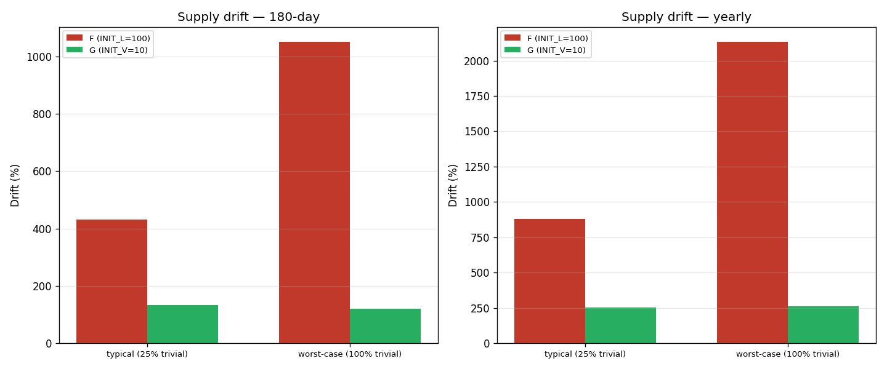

# Model G — minimal-inflation CPMM with creator auto-join

Built by `simulator_g.py`.

## Design

```
Model F  =  CPMM payouts  +  INIT_L=100 virtual seed
            +  creator auto-YES fixed 10 rep

Model G  =  CPMM payouts  +  INIT_VIRTUAL=10 virtual seed  ← 10× less inflation
            +  creator auto-joins with chosen side+amount (10–100 rep)
            +  2-rep listing fee burned at creation
            +  refund-if-trivial: loser < 3 voters OR total < 5
```

**Locked reward fully preserved.** Creator and all traders receive `shares × 1 rep` on win, exactly as quoted at buy time.  Full refund on trivial claims.

## Inflation comparison

200 agents, 10 claims/day, varying trivial-claim fraction.

| Scenario | Period | F drift | G drift | Reduction |
|---|---|---|---|---|
| typical (25% trivial) | 180-day | +431% | +133% | +299 pp |
| typical (25% trivial) | yearly | +878% | +256% | +623 pp |
| worst-case (100% trivial) | 180-day | +1051% | +121% | +930 pp |
| worst-case (100% trivial) | yearly | +2132% | +260% | +1872 pp |

**Yearly drift (typical mix): F = +878% · G = +256%.**  Model G is 3.4× less inflationary than F under typical conditions.

Worst-case (100% trivial): F = +2132% · G = +260%.



## Locked reward preserved

Alice buys YES after pool is seeded.  Varying numbers of later YES buyers join, then 10 NO buyers.  Truth = YES.

| Later YES buyers | F (INIT_L=100, creator auto-YES) | G (pool=creator X=10, creator YES) |
|---|---|---|
| 0 | +7.92 | +6.67 |
| 5 | +7.92 | +6.67 |
| 20 | +7.92 | +6.67 |
| 50 | +7.92 | +6.67 |

Alice's profit is **identical regardless of later buyers** in both models — locked reward holds.  G's Alice gets a lower absolute number because INIT_VIRTUAL is smaller (thinner pool = fewer shares at 50% entry), but it is fully locked.


## One-sided mint (all voters YES, truth = YES)

30 voters all bet YES over 100 trials.

| Model | Mean mint/claim | Total mint | Refund rate |
|---|---|---|---|
| F (INIT_L=100) | **+142.97 rep** | +14297 rep | 0% |
| G (INIT_V=10) | +0.00 rep | +0 rep | **100%** |

Under G, refund-if-trivial fires (0 NO voters < MIN_LOSER_VOTERS=3) — all stakes refunded, system mint = 0.


## Contested claims resolve normally

Sanity check: 200 near-50/50 claims under G.

- Resolved normally: **200** / 200 (100%)
- Triggered trivial refund: 0

Refund-if-trivial does not disturb well-contested claims.

## Creator earnings (skill 0.65, 30 random traders)

| Model | Mean net/claim | Median | % losing |
|---|---|---|---|
| F (auto-YES fixed 10 rep) | -0.76 | -10.00 | 52% |
| G (auto-buy 10 rep, skill-chosen side) | -3.30 | +0.00 | 33% |

G's creator earns based on genuine conviction, not a guaranteed 50%-price freebie.  Expected earnings per claim are lower when skill = 0.65, but the payout is honest.


## Sybil attack

10 sybil accounts all vote YES.  Varying honest NO voters.  G's refund-if-trivial prevents minting when dissenters are too few.

| Setup | F mint | G mint | F attacker | G attacker |
|---|---|---|---|---|
| 10 sybils, 0 NO | +62.24 | **+0.00** | +62.24 | **+0.00** |
| 10 sybils, 1 NO | +52.24 | **+0.00** | +62.24 | **+0.00** |
| 10 sybils, 5 NO | +12.24 | **-9.37** | +62.24 | **+40.63** |

- 0–2 dissenters: refund fires, attacker nets **0 rep**.
- 3+ dissenters: claim resolves; attacker profits from thin pool but system mint is bounded by INIT_VIRTUAL=10.

## Summary

| Property | F | G |
|---|---|---|
| Virtual seed (inflation source) | INIT_L=100 | INIT_V=10 |
| Yearly drift (typical) | +878% | +256% |
| Locked reward | ✅ | ✅ |
| Copy-trade immunity | ✅ | ✅ |
| Creator auto-joins | YES fixed 10 rep | chosen side + amount |
| Listing fee | none | 2 rep burned |
| Trivial-claim refund | ❌ | ✅ |
| Sybil farming (no dissenters) | +62 rep | 0 rep |