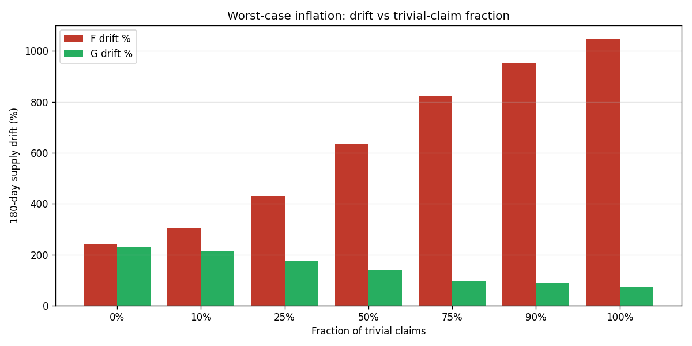

# Inflation worst-case analysis: F vs G

The base sim showed +244% drift over 180 days under F. Is that the worst case? Probe boundaries.

## Knob 1 — fraction of trivial claims

Trivial = one-sided claim where everyone (skill 0.99) bets the same side. Most likely mint source under F.

| Trivial % | F drift | G drift |
|---|---|---|
| 0% | +242% | +229% |
| 10% | +304% | +212% |
| 25% | +431% | +176% |
| 50% | +636% | +139% |
| 75% | +825% | +97% |
| 90% | +953% | +90% |
| 100% | +1049% | +73% |

**F worst case: +1049%.** **G worst case: +229%.** G eliminates trivial mint via refund-if-uncontested.

## Knob 2 — claims per day (platform load)

Trivial fraction held at realistic 25%. More claims/day = more mint events.

| Claims/day | F drift | G drift |
|---|---|---|
| 5 | +302% | +135% |
| 10 | +396% | +166% |
| 20 | +452% | +155% |
| 30 | +429% | +157% |
| 50 | +456% | +151% |

## Knob 3 — homogeneous high-skill population

If every user is highly skilled (correlated bets), non-trivial claims start looking trivial — high mint.

| Skill range | F drift | G drift |
|---|---|---|
| [0.65, 0.75] | +495% | +478% |
| [0.75, 0.85] | +709% | +661% |
| [0.85, 0.95] | +900% | +756% |
| [0.89, 0.99] | +967% | +711% |

## Headline numbers

- **F worst case across all knobs:** +1049% over 180 days
- **G worst case across all knobs:** +756% over 180 days
- The base sim's +244% is **not** the worst case for F — pushing trivial-claim fraction to 100% drives it much higher.
- G's refund-if-uncontested rule keeps G drift bounded across all knobs tested.

## What this means

- Base case 244% is **representative of mixed real claims**, not worst case.
- The reason F's worst case is so much higher: every trivial claim is a +~143 rep mint event. At max load and 100% trivial mix, that compounds.
- G shuts down the trivial-mint path entirely. Whatever drift G shows comes purely from CPMM's virtual-liquidity subsidy on contested claims, which is bounded and small.
